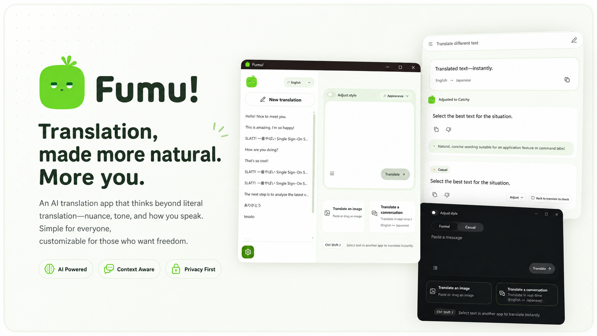

# Fumu!

> 選んだ文章を、すぐに翻訳。
> みんなのためのAI翻訳アプリ


[ダウンロード](../../releases/latest) · [GitHub Issues](../../issues)

<div align="center">
  
  <p><a href="README.md">English</a></p>
</div>

---

## 翻訳どこでも、すばやく

ブラウザでも、エディタでも、PDFでも。  
気になる文章を選んで、`Ctrl+Shift+J`。  
そばに小さなポップアップが現れて、選んだ言葉を翻訳し始める。

Fumu! を使えば面倒なコピペも、別ウィンドウへの移動も、もうしなくていい。

---

## ニュアンスまで、一緒に

翻訳は、ただの言い換えじゃない。

- **主訳** — 文脈を読んだ自然な訳
- **ニュアンス** — 訳し手の意図やトーンの解説
- **代替表現** — 違う味わいの2〜3通り

すこし便利に、すこし楽しく。

---

## あなたのAIを選ぶ

Fumu! は、あなたが選んだプロバイダーとモデルだけを使う。

- ChatGPT（Free / Plus / Pro ログイン）
- OpenAI / Anthropic / Google Gemini
- Groq / OpenRouter / DeepInfra / Mistral AI
- Ollama / LM Studio / Ollama Cloud
- 任意の OpenAI-compatible ローカルサーバー

複数モデルを有効にして、失敗したら別ので試す。

---

## インストール

[最新リリース](../../releases/latest)から `Fumu-Setup-1.0.0-x64.exe` をダウンロードして実行します。
現在のインストーラーはコード署名されていないため、Windowsの警告が表示される場合があります。

設定を開くとGitHub Releasesの最新版を確認します。「更新して再起動」でアプリ内に更新をダウンロードし、SHA-256を検証後、アプリを終了してインストール・再起動します。Windowsの権限確認が表示された場合は承認してください。ポータブル版からの更新はインストーラー版へ移行します。

---

## インスピレーション

Fumu! は [nani.now](https://nani.now/) にインスピレーションを受けています。nani.now とは独立したプロジェクトです。

---

## 開発

### 必要条件

- Windows 10 2004 以降、x64
- Node.js 24 以降
- npm 11 以降
- Native Addon を再ビルドする場合は Visual Studio 2022 Build Tools

### セットアップ

```powershell
npm install
npm run dev
```
